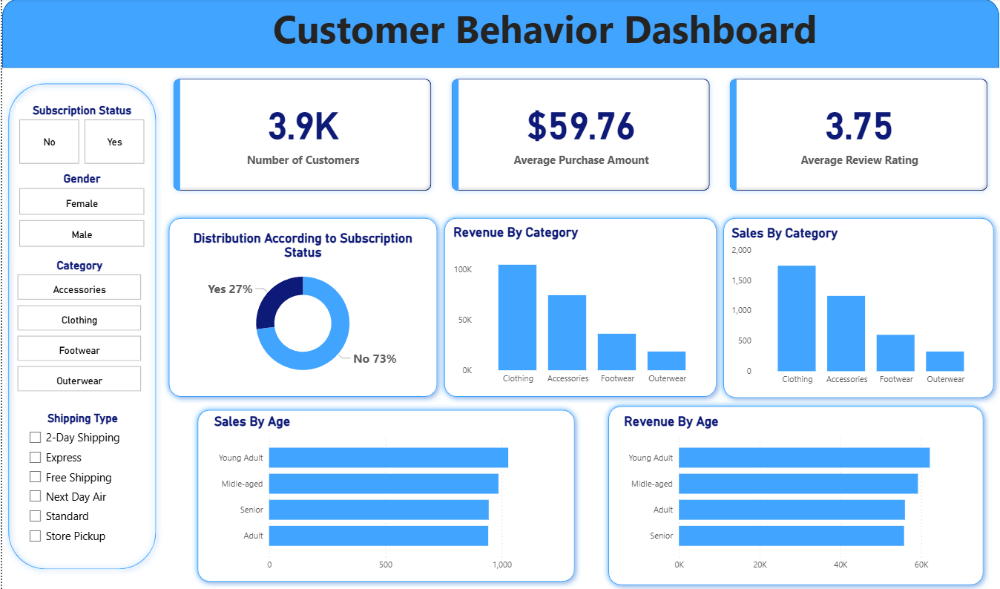

# 🛒 Customer Shopping Behavior Analysis  

### 📊 Data-Driven Insights into Customer Spending, Loyalty & Product Trends  

---

## 🧩 Overview  
This project analyzes customer shopping behavior to uncover key trends in purchasing patterns, subscription habits, and spending across various demographics and product categories.  
It was developed for a leading retail company aiming to improve **sales performance, customer engagement, and long-term loyalty**.  

The analysis integrates **Python, SQL, and Power BI** to provide end-to-end insights — from data cleaning and modeling to visualization and actionable recommendations.  

---

## 🗂️ Dataset Summary  
- **Total Records:** 3,900 transactions  
- **Columns:** 18  
- **Key Features:**  
  - *Customer Demographics:* Age, Gender, Location, Subscription Status  
  - *Purchase Details:* Item Purchased, Category, Amount, Season, Size, Color  
  - *Shopping Behavior:* Discount Applied, Promo Code Used, Previous Purchases, Review Rating, Shipping Type  
---

## 🧠 Objectives
To answer the central business question:  
> “How can the company leverage consumer shopping data to identify trends, improve customer engagement, and optimize marketing and product strategies?”

---

## ⚙️ Tools & Technologies
- **Python:** Data cleaning, feature engineering, database integration  
- **SQL (MYSQL):** Transactional analysis, segmentation, and aggregation  
- **Power BI:** Interactive dashboard for stakeholder presentation  
- **Libraries Used:** `pandas`, `numpy`, `sqlalchemy`, `matplotlib`, `seaborn`  

---

## 🧮 Data Preparation & Cleaning (Python)  
- Imported and explored the dataset using `pandas`.  
- Imputed missing `review_rating` values using the median per category.  
- Standardized column names (snake_case).  
- Engineered new columns like:
  - `age_group` – categorized customers into age brackets.  
  - `purchase_frequency_days` – measured repeat purchase intervals.  
- Dropped redundant features (`promo_code_used`).  
- Loaded cleaned data into PostgreSQL for structured querying.

---

## 🧾 Data Analysis (SQL)  
Structured queries were used to simulate business scenarios and extract insights, including:  
- **Revenue by Gender** – understanding spending differences.  
- **High-Spending Discount Users** – identifying profitable discount users.  
- **Top 5 Products by Ratings** – finding the most appreciated items.  
- **Shipping Type Comparison** – analyzing spend differences between Standard vs. Express shipping.  
- **Subscribers vs. Non-Subscribers** – evaluating loyalty program performance.  
- **Discount-Dependent Products** – determining items most reliant on discounts.  
- **Customer Segmentation** – grouping customers into *New*, *Returning*, and *Loyal* categories.  
- **Top 3 Products per Category** – ranking popular items.  
- **Repeat Buyers & Subscriptions** – linking repeat purchases with subscription status.  
- **Revenue by Age Group** – identifying high-value customer demographics.

---

## 📊 Power BI Dashboard  
An interactive Power BI dashboard was developed to visualize:  
- Category-wise sales and revenues  
- Customer demographics and purchase frequency  
- Subscription and discount analysis  
- Product performance and satisfaction ratings  

It enables decision-makers to **filter, compare, and explore** data dynamically.

Below is a snapshot of the interactive Power BI dashboard created for this analysis:

---

## 💡 Key Insights & Recommendations
- **Boost Subscriptions:** Highlight exclusive benefits to convert high-frequency buyers.  
- **Loyalty Programs:** Reward repeat buyers to nurture long-term engagement.  
- **Discount Strategy:** Optimize offers to increase sales while maintaining margins.  
- **Product Promotion:** Feature top-rated, best-selling products in campaigns.  
- **Targeted Marketing:** Focus efforts on top-spending age groups and express-shipping users.  

---

## 💬 Conclusion
This project demonstrates how **data analytics can transform raw retail data into strategic insights** that drive better customer targeting, pricing strategies, and loyalty initiatives.  

---
